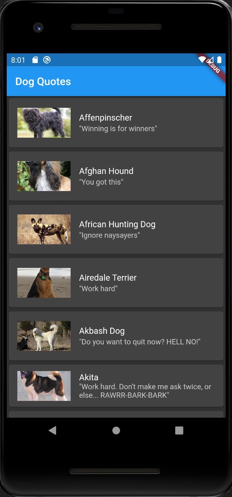
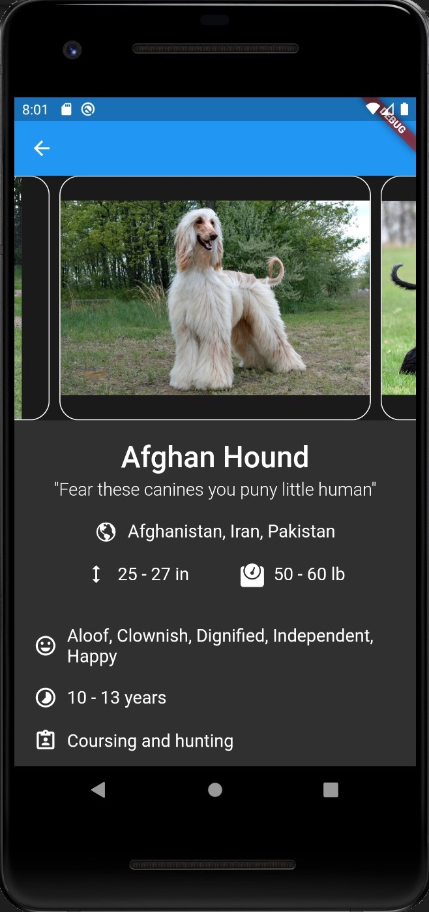
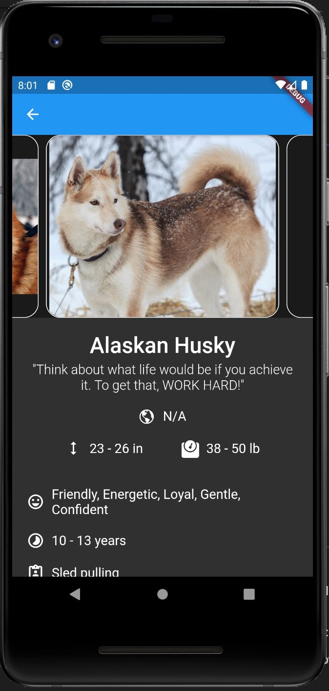
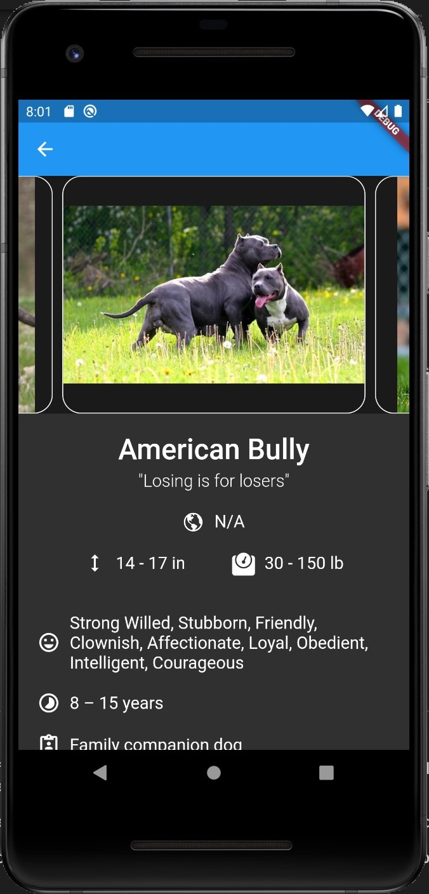
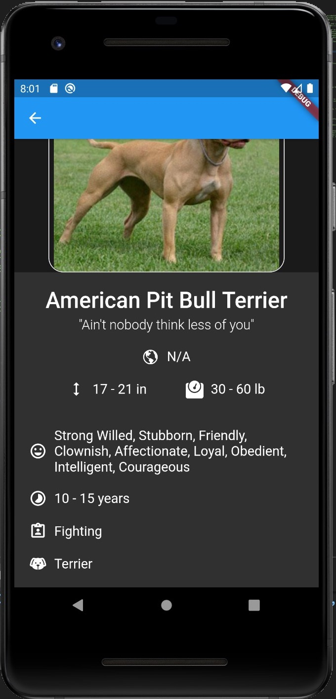
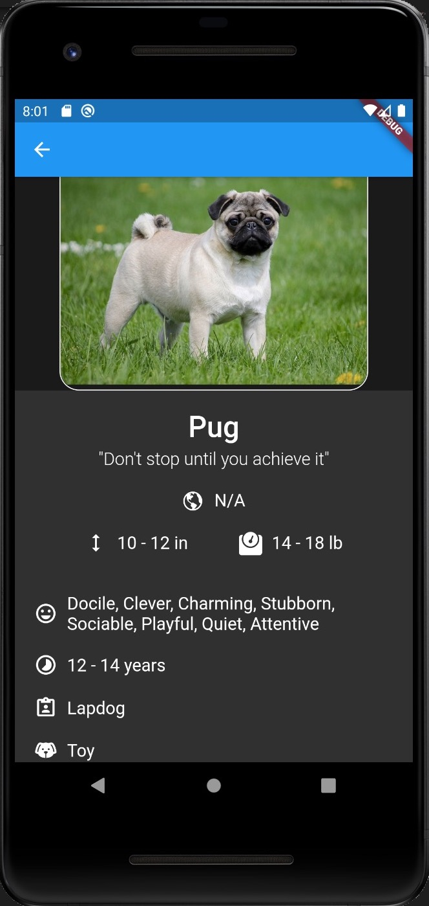
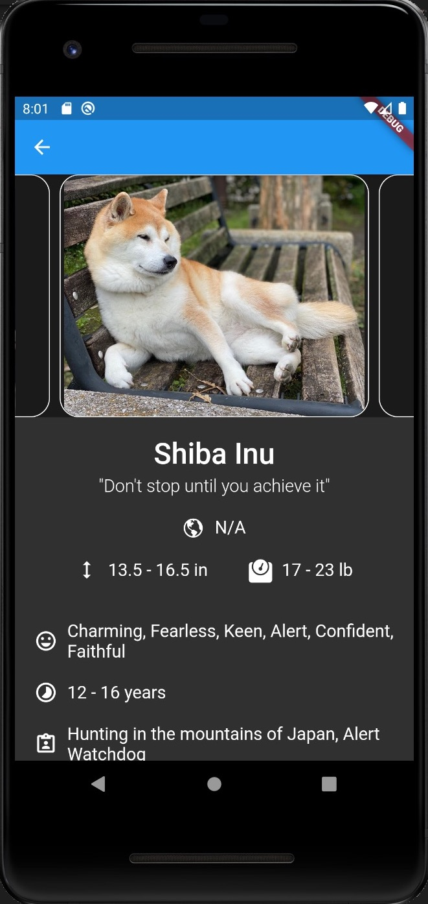

# Dog Quotes App
List of different dog breeds, details on the type of breed, and motivational quotes.

## Table of Contents
* [Objective](#objective)
* [Screenshots](#screenshots)
* [Technologies](#technologies)
* [Installing](#installing)
* [How To Run](#how-to-run)
* [Acknowledgements](#acknowledgements)
* [License](#license)

## Objective
Get some experience working with flutter and learn advanced http requests, JSON, ImageCarousel, CachedNetworkImages, Card, ListTile, Icon, BorderRadius, and ClipRRect.

## Screenshots
  
  
  
  
  
  
  

## Installing
https://flutter.dev/docs/get-started/install

## How To Run
```bash
$ cd DogQuotesApp/
$ flutter run
```

## Technologies
* Flutter version 1.24.0
* Dart version 2.12.0
* Android SDK version 30.0.2
* Gradle version 6.7
* IntelliJ IDEA Ultimate Edition version 2020.2.3
* VS Code version 1.51.1

## Acknowledgements
Flutter Lead at @DSC-LSU: [Rohan Kadkol](https://github.com/rohan-kadkol)

## License
This project is licensed under the terms of the **MIT** license. See the [LICENSE](LICENSE) file for details.
